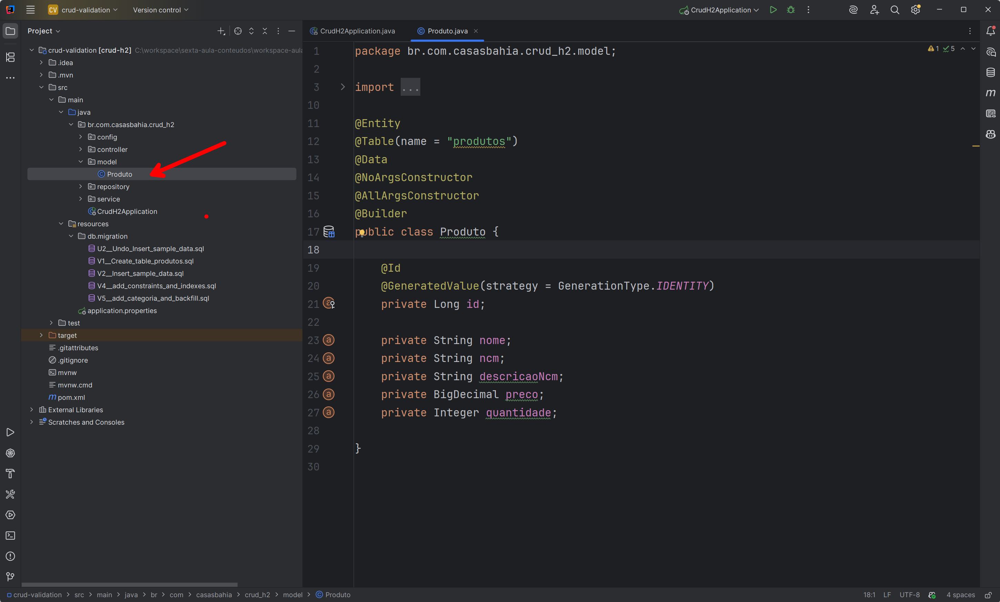
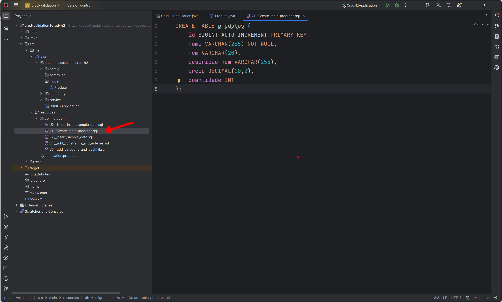
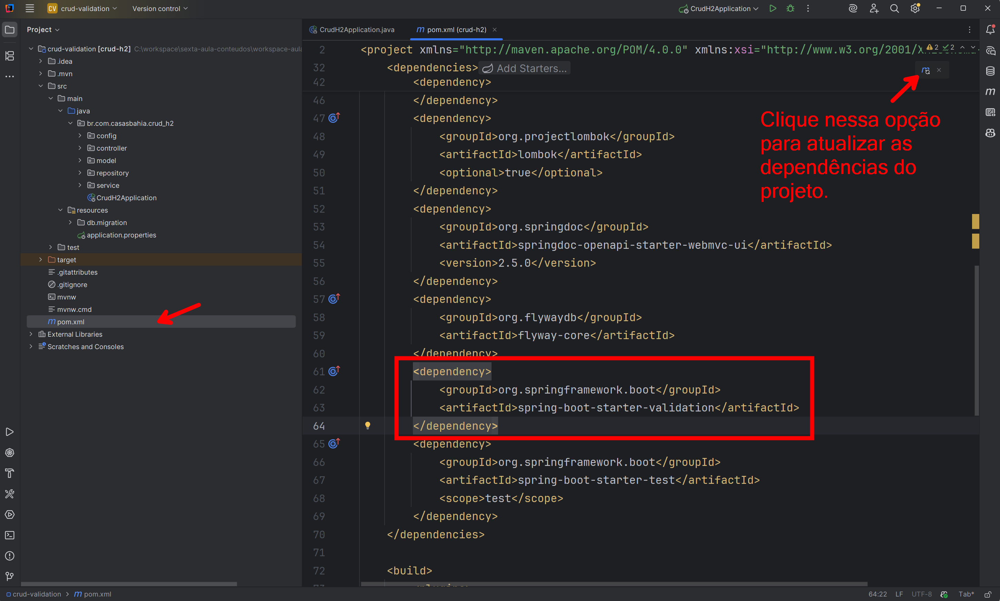
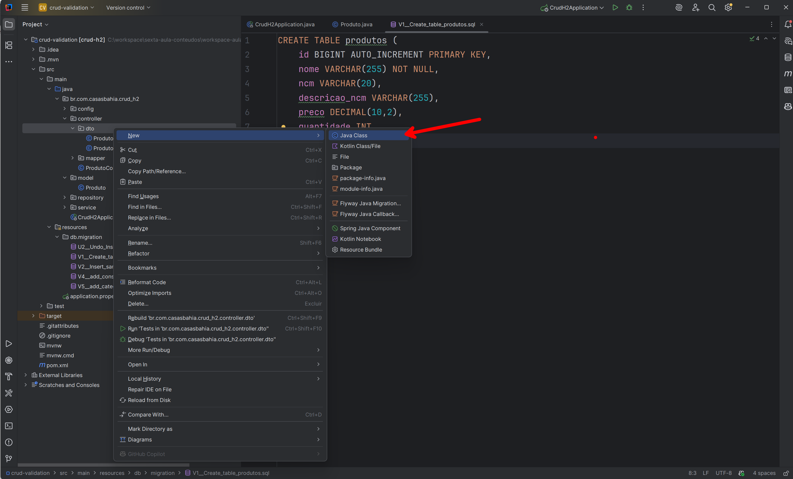
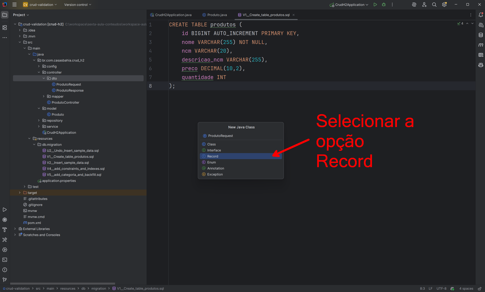
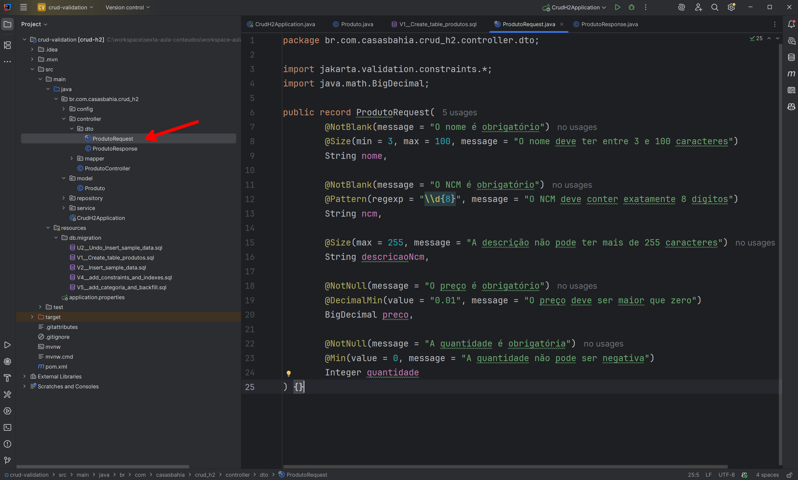
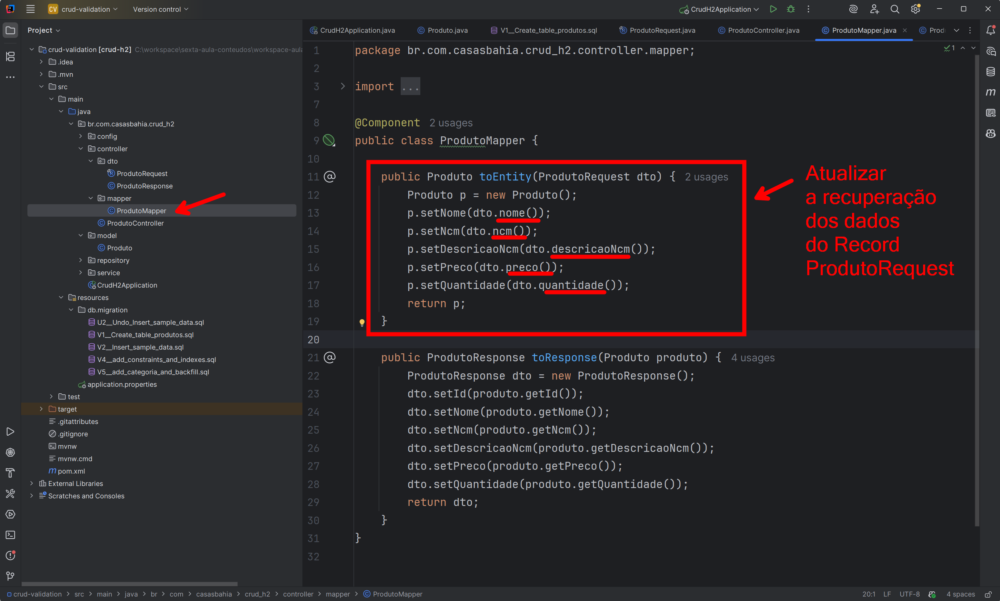
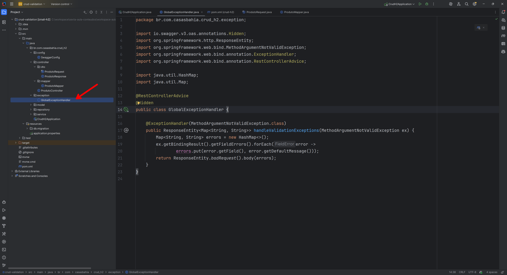
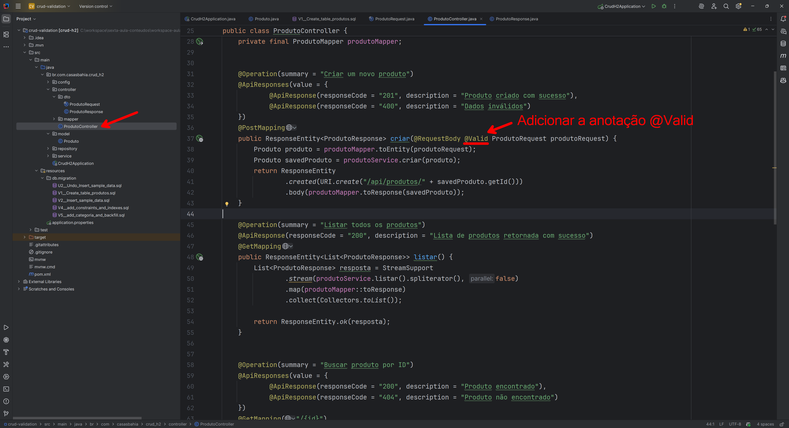
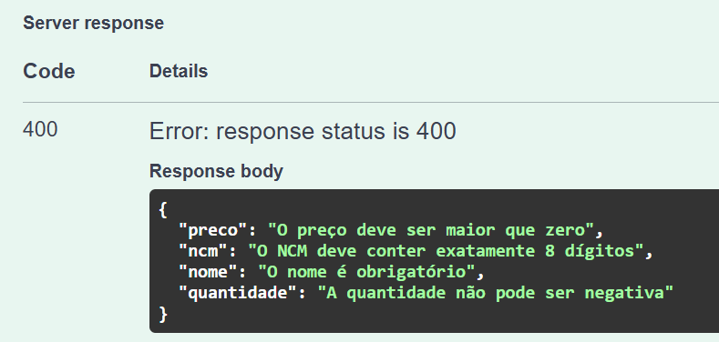

# Validação de Dados em Microserviços Java

## 🎯 Objetivo da Aula

Nesta aula, vamos evoluir o microserviço que estamos desenvolvendo em nossa jornada de estudos, adicionando **validações de dados**. 
O estudo de caso será baseado na **Aula 4 (Migrations com Flyway)**, mas as implementações podem ser aplicadas também sobre qualquer uma das aulas anteriores.

**Objetivo prático:** garantir que os dados recebidos pela API sejam **validados corretamente antes de chegar ao banco de dados**, fortalecendo as boas práticas e a confiabilidade da aplicação.

Aprenderemos:

- Como usar **Bean Validation** no Spring Boot.
- Como aplicar validações em **Records** (Java 21).
- Como integrar as validações com o **Swagger/OpenAPI**.
- Como criar **mensagens customizadas** de erro.
- Como definir **grupos de validação** para diferentes cenários.

---

## ⚙️ Pré-requisitos

- ☕ Java 21
- 🍃 Spring Boot 3.x
- 📜 Springdoc OpenAPI (implementado na Aula 3)
- 🗄️ Banco H2 + Migrations com Flyway (implementado na Aula 4)


---

## ✅ O que é Record em Java?

**Record** é um tipo especial de classe introduzido no Java para representar **dados imutáveis** de forma concisa. Pense nele como uma “classe de dados” com **intenção explícita**: transportar informações, sem comportamento complexo.

Em APIs, principalmente nos **DTOs** (objetos que entram/saem da API), você raramente precisa de lógica; precisa de **estrutura + validação**. Records fornecem exatamente isso, com menos código e menos chance de erro.

### ✨ Vantagens do uso de Record para DTOs

#### 🛡️ Imutabilidade nativa
- Todos os campos são `final` por padrão.
- Evita alterações inesperadas no objeto (especialmente importante para **entradas da API**).

#### 📉 Menos boilerplate
- Elimina boa parte de código repetitivo (muitas vezes evitando Lombok).
- O compilador gera automaticamente:
  - Construtor com todos os campos
  - `Getters`
  - `equals`, `hashCode`
  - `toString`

#### 🧩 Integração com Bean Validation
Você pode **anotar diretamente os componentes** do record:

```java
public record ProdutoRequest(
    @NotBlank String nome,
    @Pattern(regexp = "\\d{8}") String ncm,
    @DecimalMin("0.01") BigDecimal preco
) {}
```

- No controller, o Spring valida um record da **mesma forma** que validaria uma classe tradicional (`@Valid`).

#### 🔎 Clareza semântica
- Record deixa claro que o objetivo da classe é **transportar dados**.
- Ótimo para **DTOs** e **Value Objects**.

#### 🌐 Compatibilidade com Swagger/OpenAPI
- O **springdoc-openapi** interpreta records sem problemas; a documentação é gerada normalmente.

#### 🧰 Menos dependência de Lombok
- Menos “mágica” de geração de código, mais **Java puro**.

### 📜 Disponibilidade nas versões do Java
- **Java 14**: recurso em *preview*.
- **Java 16**: recurso **estável**.
- **Java 21 (LTS)**: amplamente recomendado em produção.

---

## 📖 O que é Bean Validation?
O **Bean Validation** é uma especificação da plataforma Java que define um conjunto de regras e anotações para validação de dados em objetos Java. 

### ✨ Características principais:
- **Padronizado**: segue a especificação Jakarta Bean Validation (JSR 380/399).
- **Baseado em anotações**: validações declaradas diretamente nos atributos.
- **Integração automática**: no Spring Boot, funciona de forma nativa com `@Valid` e `@Validated`.
- **Extensível**: permite criar suas próprias anotações e validadores customizados.

### ✅ Benefícios:
- Centraliza as regras de validação.
- Evita duplicação de código (regras reaproveitadas em diferentes camadas).
- Melhora a clareza e a legibilidade.
- Reduz erros, garantindo que apenas dados válidos cheguem às camadas de negócio e persistência.

### 📚 Exemplos comuns:
- `@NotNull`: Garante que o valor não seja nulo.
- `@NotBlank`: Garante que o valor não seja nulo e não seja uma string em branco.
- `@Size`: Restringe o tamanho de uma coleção, array ou string.
- `@Pattern`: Valida uma string contra uma expressão regular.
- `@Min`: Garante que um valor numérico seja maior ou igual a um valor mínimo.
- `@Max`: Garante que um valor numérico seja menor ou igual a um valor máximo.
- `@Positive`: Garante que um valor numérico seja positivo.
- `@Email`: Valida se uma string está em um formato de e-mail válido.
- `@Past`: Garante que uma data seja anterior à data atual.
- `@Future`: Garante que uma data seja posterior à data atual.

### ✅ Benefícios práticos
- **Reuso** das mesmas regras em DTOs, entidades e serviços.
- **Clareza**: regras ficam **visíveis onde os dados estão**.
- **Confiabilidade**: menos dados inválidos chegando na camada de negócio.

---


## 🧩 Revisando o Estudo de Caso implementado nas aulas anteriores

- Implementamos a entidade `Produto`:

  ```java
  @Entity
  @Table(name = "produtos")
  @Data
  @NoArgsConstructor
  @AllArgsConstructor
  @Builder
  public class Produto {

      @Id
      @GeneratedValue(strategy = GenerationType.IDENTITY)
      private Long id;

      private String nome;
      private String ncm;
      private String descricaoNcm;
      private BigDecimal preco;
      private Integer quantidade;

  }
  ```

  


- Na Aula 4, criamos a tabela **produtos** via migration:

  ```sql
  CREATE TABLE produtos (
      id BIGINT AUTO_INCREMENT PRIMARY KEY,
      nome VARCHAR(255) NOT NULL,
      ncm VARCHAR(20),
      descricao_ncm VARCHAR(255),
      preco DECIMAL(10,2),
      quantidade INT
  );
  ```

  


Agora, além de termos a classe **Produto** e a estrutura correspondente já definida no banco de dados, vamos reforçar as boas práticas em nosso projeto implementando **validações mais robustas**. O objetivo é disponibilizar mecanismos que garantam de forma confiável a integridade e a consistência dos **dados recebidos pela API**.

📌 Será usado como ponto de partida o **CRUD de Produtos** da **Aula 4 (Migrations com Flyway)**, que já possui:

- Entidade `Produto`
- Repositório, Serviço e Controlador
- Banco de dados controlado pelo **Flyway**

<br>

---


## 1️⃣📦 Adicionando a dependência de validação


- Para habilitar o **Bean Validation** no Spring Boot, é necessário adicionar a seguinte dependência no `pom.xml`:

  ```xml
  <dependency>
  <groupId>org.springframework.boot</groupId>
  <artifactId>spring-boot-starter-validation</artifactId>
  </dependency>
  ```

  

Essa dependência traz a implementação padrão do **Jakarta Bean Validation** (Hibernate Validator), responsável por processar as anotações como `@NotNull`, `@NotBlank`, etc.


---


## 2️⃣🛠️ Criando DTO com Record e Validações

- Caso, ainda não tenha feito, vamos criar um DTO `ProdutoRequest` usando **Record** para validar a entrada:

  ```java
  package br.com.casasbahia.crud_h2.controller.dto;

  import jakarta.validation.constraints.*;
  import java.math.BigDecimal;

  public record ProdutoRequest(
      @NotBlank(message = "O nome é obrigatório")
      @Size(min = 3, max = 100, message = "O nome deve ter entre 3 e 100 caracteres")
      String nome,

      @NotBlank(message = "O NCM é obrigatório")
      @Pattern(regexp = "\\d{8}", message = "O NCM deve conter exatamente 8 dígitos")
      String ncm,

      @Size(max = 255, message = "A descrição não pode ter mais de 255 caracteres")
      String descricaoNcm,

      @NotNull(message = "O preço é obrigatório")
      @DecimalMin(value = "0.01", message = "O preço deve ser maior que zero")
      BigDecimal preco,

      @NotNull(message = "A quantidade é obrigatória")
      @Min(value = 0, message = "A quantidade não pode ser negativa")
      Integer quantidade
  ) {}
  ```

  

  

  


> **Observação**: Caso já exista no projeto o arquivo `ProdutoRequest.java`, será necessário atualizá-lo para o novo formato de Record.


---


## 3️⃣🔄 Atualizando o Mapper


- Com a mudança do `ProdutoRequest` de **classe tradicional** para **Record**, também precisamos atualizar o **mapper**.


  ```java
  package br.com.casasbahia.crud_h2.controller.mapper;


  import br.com.casasbahia.crud_h2.controller.dto.ProdutoRequest;
  import br.com.casasbahia.crud_h2.controller.dto.ProdutoResponse;
  import br.com.casasbahia.crud_h2.model.Produto;
  import org.springframework.stereotype.Component;


  @Component
  public class ProdutoMapper {


  public Produto toEntity(ProdutoRequest dto) {
  Produto p = new Produto();
  p.setNome(dto.nome());
  p.setNcm(dto.ncm());
  p.setDescricaoNcm(dto.descricaoNcm());
  p.setPreco(dto.preco());
  p.setQuantidade(dto.quantidade());
  return p;
  }


  public ProdutoResponse toResponse(Produto produto) {
  ProdutoResponse dto = new ProdutoResponse();
  dto.setId(produto.getId());
  dto.setNome(produto.getNome());
  dto.setNcm(produto.getNcm());
  dto.setDescricaoNcm(produto.getDescricaoNcm());
  dto.setPreco(produto.getPreco());
  dto.setQuantidade(produto.getQuantidade());
  return dto;
  }
  }
  ```

  

### 📝 Diferença na recuperação dos atributos
- **Antes (classe tradicional com getters):**
  ```java
  p.setNome(dto.getNome());
  ```


- **Agora (usando Record):**
  ```java
  p.setNome(dto.nome());
  ```


### 🤔 Por que essa diferença?
- Records não usam **getters convencionais** (`getNome()`).
- Cada campo declarado no record gera automaticamente um **accessor method** com o mesmo nome do campo (`dto.nome()`).
- Isso reflete a ideia de que Records são **estruturas de dados imutáveis**, e seus valores são acessados de forma direta e clara.


✅ Essa abordagem simplifica o código, evita duplicação de métodos e deixa explícito que o objeto é apenas um **portador de dados**.


---


## 4️⃣⚠️ Tratamento Global de Erros de Validação


Para melhorar a experiência do cliente da API, podemos capturar os erros de validação em um **handler global**. Assim, retornamos uma resposta mais amigável em formato JSON.


- Exemplo de implementação:

  ```java
  package br.com.casasbahia.crud_h2.exception;


  import io.swagger.v3.oas.annotations.Hidden;
  import org.springframework.http.ResponseEntity;
  import org.springframework.web.bind.MethodArgumentNotValidException;
  import org.springframework.web.bind.annotation.ExceptionHandler;
  import org.springframework.web.bind.annotation.RestControllerAdvice;


  import java.util.HashMap;
  import java.util.Map;


  @RestControllerAdvice
  @Hidden
  public class GlobalExceptionHandler {


  @ExceptionHandler(MethodArgumentNotValidException.class)
  public ResponseEntity<Map<String, String>> handleValidationExceptions(MethodArgumentNotValidException ex) {
  Map<String, String> errors = new HashMap<>();
  ex.getBindingResult().getFieldErrors().forEach(error ->
  errors.put(error.getField(), error.getDefaultMessage()));
  return ResponseEntity.badRequest().body(errors);
  }
  }
  ```
  

  


✅ Assim, toda vez que ocorrer uma validação falha, a resposta será padronizada, retornando os **campos inválidos** e suas respectivas mensagens.


---


## 5️⃣⚡ Atualizando o Controller
- No `ProdutoController`, validamos o DTO com `@Valid`:

  ```java
  @PostMapping
  public ResponseEntity<ProdutoResponse> criar(@RequestBody @Valid ProdutoRequest produtoRequest) {
      Produto produto = produtoMapper.toEntity(produtoRequest);
      Produto salvo = produtoService.criar(produto);
      return ResponseEntity
              .created(URI.create("/api/produtos/" + salvo.getId()))
              .body(produtoMapper.toResponse(salvo));
  }
  ```

  

Agora, qualquer requisição inválida retorna automaticamente **HTTP 400 Bad Request** com os erros.

---

## ▶️ Testando
1. Suba a aplicação.  
2. Acesse [http://localhost:8080/swagger-ui/index.html](http://localhost:8080/swagger-ui/index.html).  
3. Envie um JSON inválido:
   ```json
   {
     "nome": "",
     "ncm": "abc",
     "preco": -10,
     "quantidade": -1
   }
   ```
4. A resposta será algo como:
   ```json
   {
     "errors": [
       "O nome é obrigatório",
       "O NCM deve conter exatamente 8 dígitos",
       "O preço deve ser maior que zero",
       "A quantidade não pode ser negativa"
     ]
   }
   ```

   

Com essa nova abordagem, a resposta de erro será mais clara e organizada.

---

<br><br>

# 📚 Fortalecendo o Conhecimento


## Melhorando a Experiência do Usuário no Swagger

- Podemos adicionar descrições e exemplos aos nossos endpoints usando anotações do Swagger.
```java
package br.com.casasbahia.crud_h2.controller.dto;

import io.swagger.v3.oas.annotations.media.Schema;
import jakarta.validation.constraints.*;
import java.math.BigDecimal;

@Schema(description = "Objeto utilizado para criar ou atualizar um produto")
public record ProdutoRequest(

        @Schema(
                description = "Nome do produto",
                example = "Notebook Dell"
        )
        @NotBlank(message = "O nome é obrigatório")
        @Size(min = 3, max = 100, message = "O nome deve ter entre 3 e 100 caracteres")
        String nome,

        @Schema(
                description = "Código NCM com 8 dígitos",
                example = "12345678"
        )
        @NotBlank(message = "O NCM é obrigatório")
        @Pattern(regexp = "\\d{8}", message = "O NCM deve conter exatamente 8 dígitos")
        String ncm,

        @Schema(
                description = "Descrição opcional do NCM",
                example = "Notebook com processador Intel Core i7"
        )
        @Size(max = 255, message = "A descrição não pode ter mais de 255 caracteres")
        String descricaoNcm,

        @Schema(
                description = "Preço do produto",
                example = "2999.99"
        )
        @NotNull(message = "O preço é obrigatório")
        @DecimalMin(value = "0.01", message = "O preço deve ser maior que zero")
        BigDecimal preco,

        @Schema(
                description = "Quantidade disponível em estoque",
                example = "10"
        )
        @NotNull(message = "A quantidade é obrigatória")
        @Min(value = 0, message = "A quantidade não pode ser negativa")
        Integer quantidade
) {}
```

- @Schema permite adicionar metadados aos campos do DTO, como descrição e exemplo.

## 🎨 Mensagens Customizadas via Arquivo
- Podemos centralizar as mensagens em `messages.properties`:

  ```properties
  produto.nome.notblank=O nome do produto é obrigatório
  produto.nome.size=O nome deve ter entre {min} e {max} caracteres
  produto.ncm.pattern=O NCM deve conter exatamente 8 dígitos
  produto.preco.min=O preço deve ser maior que zero
  produto.quantidade.min=A quantidade não pode ser negativa
  ```

- E referenciamos nas anotações:

  ```java
  @NotBlank(message = "{produto.nome.notblank}")
  @Size(min = 3, max = 100, message = "{produto.nome.size}")
  String nome;
  ```

---

## 🧪 Grupos de Validação (Create vs Update)
**Cenário:**
- Na criação (`POST`), o **ID não deve ser informado**.
- Na atualização (`PUT`), o **ID é obrigatório**.

- Criamos dois grupos:

  ```java
  public interface OnCreate {}
  public interface OnUpdate {}
  ```

- E aplicamos no DTO:

  ```java
  public record ProdutoRequest(
      @Null(groups = OnCreate.class, message = "O ID deve ser nulo na criação")
      @NotNull(groups = OnUpdate.class, message = "O ID é obrigatório na atualização")
      Long id,
      ...
  ) {}
  ```

- No controller:

  ```java
  @PostMapping
  public ResponseEntity<ProdutoResponse> criar(
          @Validated(OnCreate.class) @RequestBody ProdutoRequest request) { ... }

  @PutMapping("/{id}")
  public ResponseEntity<ProdutoResponse> atualizar(
          @Validated(OnUpdate.class) @RequestBody ProdutoRequest request) { ... }
  ```


> **Observação**: Separar DTOs para Create e Update é uma boa prática para manter a clareza e a organização do código.

Segue um exemplo:

- `ProdutoCreateRequest.java`

  ```java
  public record ProdutoCreateRequest(

      @NotBlank(message = "O nome é obrigatório")
      String nome,

      @NotBlank(message = "O NCM é obrigatório")
      String ncm,

      BigDecimal preco,
      Integer quantidade
  ) {}

  ```

- `ProdutoUpdateRequest.java`

  ```java
  public record ProdutoUpdateRequest(

      @NotNull(message = "O ID é obrigatório")
      Long id,

      @NotBlank(message = "O nome é obrigatório")
      String nome,

      @NotBlank(message = "O NCM é obrigatório")
      String ncm,

      BigDecimal preco,
      Integer quantidade
  ) {}
  ```


---


## 🔑 Diferença entre @Valid e @Validated


Um ponto importante para quem está começando é entender **quando usar `@Valid` e quando usar `@Validated`**.


### ▶️ @Valid
- Faz parte da especificação Bean Validation (Jakarta).
- É usado para validar **objetos completos** com base nas anotações declaradas.
- Muito comum em parâmetros de métodos de controller:


  ```java
  @PostMapping
  public ResponseEntity<ProdutoResponse> criar(@RequestBody @Valid ProdutoRequest request) { ... }
  ```


👉 Simples e direto para validar um DTO inteiro.


### ▶️ @Validated
- É uma anotação do **Spring Framework**.
- Além de suportar Bean Validation, permite usar **grupos de validação**.
- Muito útil quando você precisa de regras diferentes em **cenários distintos** (ex.: criação vs atualização):


  ```java
  @PostMapping
  public ResponseEntity<ProdutoResponse> criar(
  @Validated(OnCreate.class) @RequestBody ProdutoRequest request) { ... }


  @PutMapping("/{id}")
  public ResponseEntity<ProdutoResponse> atualizar(
  @Validated(OnUpdate.class) @RequestBody ProdutoRequest request) { ... }
  ```


👉 Use `@Validated` quando precisar de **maior flexibilidade** com grupos de validação.


---

<br><br>

## 🚀 Conclusão
- ✅ Validação garante **qualidade e consistência dos dados**.
- 🧩 **Bean Validation** é simples de integrar no Spring Boot.
- 📦 **Records** deixam o código mais limpo e seguro para DTOs.
- 📜 **Swagger/OpenAPI** documenta automaticamente as restrições.

<br>
👉 **Próxima aula (Aula 6 – Tratamento de Erros)**: veremos como **padronizar as respostas de erro**, retornando mensagens organizadas para o cliente da API.
